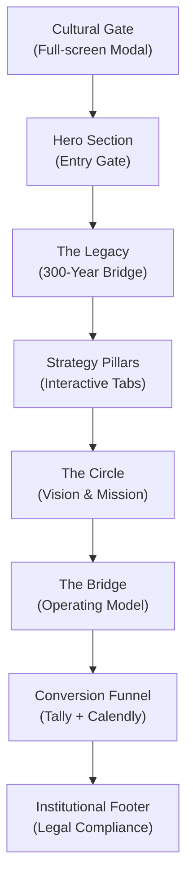

# Nafasz Global — Sovereign Trust Portal: Implementation Plan

## 1. PRD Analysis Summary

Nafasz Global membutuhkan website bertipe **single-page prestige portal** yang memancarkan kredibilitas institusional tingkat tinggi (setara Rothschild & Co / Macquarie Group). Website ini bukan SaaS atau e-commerce — melainkan **corporate trust portal** dengan narasi kuat dan konversi prospek strategis.

### Key Requirements dari PRD

| Aspek | Detail |
|---|---|
| **Target Launch** | Senin, 2 Maret 2026 (besok!) |
| **Tipe Website** | Single-page prestige portal with cultural gate |
| **Palet Warna** | Charcoal `#1A1A1A`, Ochre `#B35900`, Soft White `#F5F5F5` |
| **Gaya Visual** | Earthy, mewah, simpel, tekstur maritim abstrak, efek grainy |
| **Animasi** | Smooth fade-in, subtle slow gradient, grain drift — NO scroll distraction |
| **Mobile-First** | Mandatory |
| **Performa** | Load time < 2.5 detik |
| **Bahasa** | Bilingual EN/ID (formal, elegan, institusional) |
| **Larangan** | ❌ Stock imagery, ❌ "Decolonisation", ❌ "Pty Ltd"/"CV" di luar footer |

### Struktur Halaman (8 Sections)



---

## 2. Design Reference: L40.com Analysis


L40.com adalah boutique M&A advisory firm — sangat selaras dengan positioning Nafasz Global sebagai "Sovereign Trust Portal". Berikut pola desain yang akan kita adopsi:

### Design Patterns to Adopt

| Pola L40 | Adaptasi untuk Nafasz Global |
|---|---|
| **Atmospheric coastal hero** dengan overlay gradient | Hero dengan maritime/Arafura texture + charcoal overlay |
| **Deep Navy** + generous whitespace | Charcoal `#1A1A1A` + Ochre `#B35900` + Soft White `#F5F5F5` |
| **Large serif headline** + clean sans-serif body | Cormorant Garamond headlines + Inter body |
| **Scroll-triggered fade-in & slide-up** | Subtle fade-in per section (no parallax — PRD says "no scroll distraction") |
| **Minimalist hamburger nav** (logo left, menu right) | Same pattern — clean top bar |
| **Bold CTA buttons** with arrow icon (→) | "Enter The Circle" dan "I Acknowledge & Enter" |
| **Flowing page sections** with ample padding | 100vh-ish sections, generous vertical spacing |
| **Client logo ticker strip** | Monochrome IA-CEPA & Future Made in Australia logos |

### Key Differences from L40

- L40 uses **stock coastal photography** — Nafasz must use **generated abstract maritime textures** (no stock imagery)
- L40 has **blue palette** — Nafasz uses **earthy charcoal + ochre**
- L40 has subtle parallax — Nafasz should avoid it (PRD: "no scroll distraction")
- Nafasz adds unique **Cultural Gate modal** before entry
- Nafasz needs **bilingual toggle** (EN/ID)
- Nafasz has **grainy/archival texture** aesthetic vs L40's clean photography


---

## 3. Tech Stack & Rationale

### Rekomendasi: **Vite + Vanilla JS + Vanilla CSS**

| Layer | Teknologi | Alasan |
|---|---|---|
| **Build Tool** | **Vite** | Lightning-fast dev server, optimized production build, excellent asset handling |
| **Logic** | **Vanilla JavaScript (ES Modules)** | Website ini bukan app — tidak butuh React/Vue. Vanilla JS lebih ringan, cepat, dan sesuai target performa <2.5s |
| **Styling** | **Vanilla CSS (Custom Properties)** | Full control untuk aesthetic yang sangat spesifik (grainy texture, maritime, fade-in). CSS framework akan membatasi kreativitas |
| **Font** | **Google Fonts (Inter / Cormorant Garamond)** | Inter untuk body (modern, clean), Cormorant Garamond untuk headline (institutional elegance) |
| **Animation** | **CSS Animations + Intersection Observer** | Lightweight, performant fade-in dan scroll-triggered animations tanpa library tambahan |
| **i18n** | **Custom JSON-based i18n** | Solusi ringan untuk dual-language toggle tanpa overhead library i18n besar |
| **Form** | **Tally / Typeform Embed** | Sesuai PRD — embed form minimalis hitam |
| **Booking** | **Calendly Embed** | Sesuai PRD — redirect setelah form submission |
| **Deployment** | **Netlify / Vercel (Static)** | Deploy instan, CDN global, HTTPS gratis |

### Mengapa BUKAN Next.js / React?

> [!IMPORTANT]
> Website ini adalah **static prestige portal**, bukan web application. Menggunakan React/Next.js akan menambah ~150KB+ bundle size yang unnecessary, memperlambat load time, dan menambah kompleksitas tanpa manfaat. Vanilla approach memberikan **performa terbaik** dan **kontrol design penuh** sesuai target <2.5s load time.

---

## 4. Proposed Changes — Execution Status

### A. Project Foundation ✅

#### ✅ [CREATED] [package.json](file:///Users/rezaaldi/Documents/Projects/nafaszglobal/package.json)
- Vite project initialized, dependencies installed (13 packages)
- Scripts: `dev`, `build`, `preview`

#### ✅ [CREATED] [vite.config.js](file:///Users/rezaaldi/Documents/Projects/nafaszglobal/vite.config.js)
- Build optimization, dev server on port 3000

#### ✅ [CREATED] [index.html](file:///Users/rezaaldi/Documents/Projects/nafaszglobal/index.html)
- Semantic HTML5 structure dengan semua 8 sections
- SEO meta tags, Open Graph tags
- Google Fonts preconnect
- All text elements have `data-i18n` attributes

---

### B. Design System & Styling ✅

#### ✅ [CREATED] [variables.css](file:///Users/rezaaldi/Documents/Projects/nafaszglobal/src/css/variables.css)
- CSS Custom Properties: color palette, fluid typography scale, spacing, transitions

#### ✅ [CREATED] [base.css](file:///Users/rezaaldi/Documents/Projects/nafaszglobal/src/css/base.css)
- CSS reset, base typography, grain overlay, scrollbar, mobile-first defaults

#### ✅ [CREATED] [sections.css](file:///Users/rezaaldi/Documents/Projects/nafaszglobal/src/css/sections.css)
- Per-section styling untuk semua 8 sections + navigation
- Grainy texture overlay, maritime abstract backgrounds
- Responsive breakpoints (768px tablet, 1024px desktop)

#### ✅ [CREATED] [animations.css](file:///Users/rezaaldi/Documents/Projects/nafaszglobal/src/css/animations.css)
- Fade-in keyframes, grain drift, gate animations, pulse glow
- Intersection Observer triggered `.reveal`, `.reveal-stagger`, `.fade-in` classes

---

### C. JavaScript Modules ✅

#### ✅ [CREATED] [main.js](file:///Users/rezaaldi/Documents/Projects/nafaszglobal/src/main.js)
- Entry point, CSS + JS module imports, DOMContentLoaded initialization

#### ✅ [CREATED] [cultural-gate.js](file:///Users/rezaaldi/Documents/Projects/nafaszglobal/src/js/cultural-gate.js)
- Full-screen modal logic with fade-out animation
- "I Acknowledge & Enter" button handler
- SessionStorage: gate ditampilkan sekali per sesi

#### ✅ [CREATED] [i18n.js](file:///Users/rezaaldi/Documents/Projects/nafaszglobal/src/js/i18n.js)
- Bilingual toggle system (EN ↔ ID)
- Dot-notation JSON key resolver
- `data-i18n` attribute system, persistent via localStorage

#### ✅ [CREATED] [pillars.js](file:///Users/rezaaldi/Documents/Projects/nafaszglobal/src/js/pillars.js)
- Hover interaction untuk Desktop (CSS-driven)
- Accordion click toggle untuk Mobile (<1024px)
- Auto-activate first pillar on mobile

#### ✅ [CREATED] [animations.js](file:///Users/rezaaldi/Documents/Projects/nafaszglobal/src/js/animations.js)
- Intersection Observer untuk scroll-triggered reveals (threshold: 0.15)
- Nav scroll effect (backdrop blur setelah 60px)

#### ✅ [CREATED] [form.js](file:///Users/rezaaldi/Documents/Projects/nafaszglobal/src/js/form.js)
- Native form handler dengan success state
- ⏳ Tally/Typeform embed (menunggu akun)
- ⏳ Calendly redirect (menunggu link)

---

### D. Translation Files ✅

#### ✅ [CREATED] [en.json](file:///Users/rezaaldi/Documents/Projects/nafaszglobal/src/locales/en.json)
- Complete English copy sesuai PRD (exact copy)

#### ✅ [CREATED] [id.json](file:///Users/rezaaldi/Documents/Projects/nafaszglobal/src/locales/id.json)
- Complete Indonesian translation (formal, elegan, institusional)

---

### E. Assets ⏳ (Partial)

#### ⏳ [PENDING] src/assets/
- Grain texture: ✅ implemented via inline SVG noise filter (zero image downloads)
- Favicon: ✅ inline SVG favicon
- ⏳ Generated maritime textures (optional enhancement)
- ⏳ OG image for social sharing
- ⏳ Actual monochrome logos (IA-CEPA, Future Made in Australia) — currently SVG text placeholders

---

## 5. Section Implementation Details

### A. Cultural Gate (Pop-Up Modal)
- Full-screen overlay with `position: fixed`
- Background: maritime grainy texture dengan opacity
- Content: Exact acknowledgement copy dari PRD
- Button: "[I Acknowledge & Enter]" — removes modal with fade-out
- SessionStorage check: skip jika sudah acknowledged

### B. Hero Section
- Headline: "Old Wisdom, New Markets: Architecting the Future of Exchange."
- Sub-headline: Boutique advisory description
- CTA: "Enter The Circle" — smooth scroll ke The Circle section
- Background: subtle gradient Charcoal → slightly lighter
- Typography: Cormorant Garamond untuk headline, Inter untuk sub

### C. The Legacy (300-Year Bridge)
- Narasi sejarah Yolngu-Macassan trade
- Visual: timeline atau split-panel dengan grainy texture
- Fade-in on scroll

### D. Strategy Pillars
- Desktop: Tab/hover interaction — 4 pillars
- Mobile: Vertical accordion stack
- Each pillar with exact copy dari PRD
- Subtle transition antar pillar

### E. The Circle (Vision & Mission)
- Ecosystem map: Naarm — Jakarta — Indo-Pacific corridor
- Vision & Mission statements (exact copy)
- Optional: CSS-based map visualization (no heavy map library)

### F. The Bridge (Operating Model)
- 3-phase flowchart: Listen → Align → Execute
- CSS/SVG-based flowchart (lightweight)
- Connecting lines dengan animasi

### G. Conversion Funnel
- Question: "What is your vision for 300 years of exchange?"
- Tally/Typeform embed (dark minimalist theme)
- Post-submit → success page → Calendly booking
- Auto-reply email setup (director@nafaszglobal.com)

### H. Institutional Footer
- Dual-branch: Australia (Naarm) & Indonesia (Jakarta)
- Legal entities dengan "Pty Ltd" dan "CV" — **ONLY here**
- Compliance statement
- Monochrome partner logos

---

## 6. Bilingual System (i18n)

```
Approach: data-attribute based translation
```

- Setiap elemen teks memiliki `data-i18n="key"`
- Toggle button di navbar: 🌐 EN | ID
- Translations disimpan di JSON files
- Default: English
- Persistent via `localStorage`

---

## 7. Performance Budget — Results

| Metric | Target | Actual | Status |
|---|---|---|---|
| Total Bundle Size (JS) | < 50KB gzipped | **4.78KB** gzipped | ✅ |
| Total CSS | < 30KB gzipped | **4.28KB** gzipped | ✅ |
| HTML | — | **4.61KB** gzipped | ✅ |
| Texture Assets | < 200KB total | **0KB** (inline SVG) | ✅ |
| Build Time | — | **751ms** | ✅ |
| Total Page Load | < 2.5s | ⏳ To be measured on deploy | — |
| Lighthouse Score | > 90 | ⏳ To be measured on deploy | — |

---

## 8. Verification Plan — Results

### Automated / Dev Verification

1. ✅ **Build Check** — Zero errors, built in 751ms
2. ✅ **Dev Server** — Running on `http://localhost:3000/`

### Browser-Based Verification

3. ✅ **Visual Verification** — Semua 8 sections tampil dengan benar
4. ✅ **Cultural Gate** — Modal muncul pertama kali, dismiss dengan fade-out
5. ✅ **Bilingual Toggle** — EN ↔ ID berfungsi, teks berubah semua
6. ✅ **Strategy Pillars** — Hover expand (desktop) dan click accordion (mobile)

### Compliance Checks

7. ✅ **"Pty Ltd" / "CV"** — Hanya muncul di footer dan translation files
8. ✅ **"Decolonisation"** — Tidak ditemukan di manapun
9. ✅ **No stock imagery** — Semua visual via CSS/SVG, zero stock images

### Manual Verification (oleh User)

5. **User Testing**
   - User membuka website di browser mobile untuk verifikasi mobile-first design
   - User mengecek Tally/Typeform form submission flow
   - User mengecek Calendly booking redirect
   - User memverifikasi auto-reply email dari director@nafaszglobal.com
   - User review kualitas terjemahan Bahasa Indonesia

> [!WARNING]
> **Catatan Timeline**: PRD menyebutkan target launch **2 Maret 2026** (besok). Mengingat scope yang cukup besar (8 sections + bilingual + interaktif), kita perlu memprioritaskan core sections terlebih dahulu dan iterasi setelahnya. Apakah ada section yang bisa di-simplify atau di-defer untuk post-launch?
